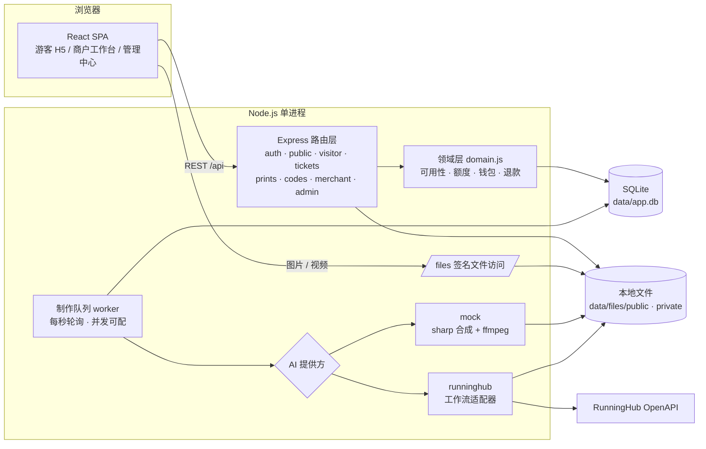
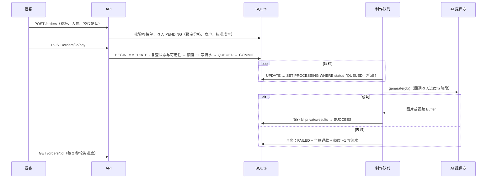

# 影小沐 AIGC 景区旅拍平台 · 技术白皮书

版本：1.0（基于当前代码整理）　日期：2026-09-29

---

## 1. 概述

系统由一个 Node.js 单进程承担三件事：
- 提供 REST API
- 托管前端单页应用
- 在进程内运行制作队列

数据存放在嵌入式 SQLite 和本地文件目录中，不依赖外部数据库或消息队列。AI 生成通过可插拔的提供方适配层完成：默认使用本地模拟生成，配置后可切换到 RunningHub 工作流。

设计取向：
- **部署极简**：一条命令启动，首次启动自动建表、初始化数据。
- **资金一致**：金额用整数「分」存储，关键流转放在同步事务中完成，并用条件更新防止并发重复。
- **隐私默认**：游客素材和作品只能通过有时效的签名链接访问。
- **AI 可替换**：业务层与生成实现解耦，不改业务代码就能更换模型服务。

---

## 2. 技术栈

| 层 | 选型 | 版本 | 用途 |
| --- | --- | --- | --- |
| 运行时 | Node.js | ≥ 22.13（实测 24.19） | 使用内置 `node:sqlite`、`fetch`、`FormData`、`--env-file`、`node:test` |
| Web 框架 | Express | 4.22 | 路由、JSON 解析、静态资源 |
| 上传 | multer | 2.0 | multipart 解析（内存存储） |
| 数据库 | SQLite（`node:sqlite`） | 内置 | WAL 模式，外键约束 |
| 图像处理 | sharp（libvips） | 0.34.5 | 图片校验、旋转、压缩、合成 |
| 视频处理 | ffmpeg（ffmpeg-static） | 5.3.0 | 帧序列成片、人物叠加到样片上 |
| 前端 | React | 19.3 | 单页应用 |
| 前端路由 | react-router-dom | 7 | History 路由 |
| 构建 | Vite | 7.3 | 开发服务器与生产构建 |

前端没有使用 UI 组件库，样式是手写 CSS，基于 CSS 变量的深色主题，移动优先。

---

## 3. 总体架构



开发时，Vite（端口 5173）把 `/api` 和 `/files` 代理到后端（端口 3000）。生产环境由后端直接托管 `web/dist`：非 `/api`、非 `/files` 的 GET 请求一律返回 `index.html`，由前端路由处理。

---

## 4. 代码结构

```
server/
  index.js            启动入口：首次启动自动初始化数据 → 监听端口 → 启动制作队列
  app.js              Express 应用：文件访问、API 挂载、SPA 托管、统一错误处理
  config.js           环境变量与目录；APP_SECRET 未配置时自动生成并持久化
  db.js               表结构、字段迁移、查询与事务工具
  auth.js             密码哈希、会话、登录态解析、角色守卫、登录限流
  captcha.js          SVG 图形验证码（内存保存、一次性）
  storage.js          文件 key 规范、图片/视频校验与规范化、签名 URL
  domain.js           服务可用性、订单/模板/景区视图、商户钱包、额度调整、失败退款
  constants.js        服务定义与默认价格、角色
  util.js             错误类型、时间、流水号、金额解析、分页、审计日志
  routes/             auth · public · visitor · tickets · print · codes · merchant · admin
  ai/                 worker 制作队列 · mock · runninghub · compose 图像合成 · video 视频
  seed.js             初始化数据（优先使用原站素材）
  seed-art.js         程序生成的山景插画（没有原站素材时使用）
  seed-assets/origin  原站模板素材与 manifest.json
  test/               端到端测试（node:test）
web/src/
  api.js ctx.jsx ui.jsx format.js     请求封装、全局状态、通用组件、格式化
  App.jsx                             路由与五位底部导航
  pages/                              游客页面、Merchant.jsx、admin/*
  components/                         登录弹窗、人物上传、打印履约、兑换码、使用统计、图表
web/public/origin                     原站界面素材（图标、头像、欢迎视频）
scripts/fetch-origin-assets.mjs       同步原站公开素材
config/runninghub.example.json        RunningHub 工作流映射示例
```

---

## 5. 数据模型

所有金额字段的单位都是「分」（整数）。时间以本地时间字符串 `YYYY-MM-DD HH:MM:SS` 存储。

| 表 | 主要字段 | 说明 |
| --- | --- | --- |
| users | username（不区分大小写，唯一）、password_hash、role、status、points、code_quota、merchant_name | 三种角色共用一张表 |
| sessions | token_hash、user_id、expires_at | 只保存令牌的 SHA-256 哈希 |
| scenes | name、status（ACTIVE/PAUSED）、merchant_id（唯一）、merchant_name、service_phone、service_hours、print_enabled、pickup_address | merchant_id 唯一，保证「一商户一景区」 |
| scene_services | (scene_id, service_type) 主键、enabled、quota（CHECK ≥ 0）、visitor_price、merchant_price | 每个景区每项服务一行 |
| templates | scene_id、service_type、code（唯一）、title、cover、background、bg_width/height、base_image、sample_video、anchor_x/y、person_height、price（可空）、video_pipeline、owner_id、status（ON/OFF/ARCHIVED）、featured、sort | price 为空时使用景区统一价 |
| characters | user_id、name、body_image、face_image、status | 人物模板，软删除，原始文件立即删除 |
| uploads | user_id、kind、file_key | 游客自传白模，下单时校验归属 |
| orders | order_no、user_id、scene_id、merchant_id、template_id、character_id、service_type、custom_base、amount、unit_cost、status、progress、stage、result_key、result_kind、error、provider、provider_task、refund_amount 及各时间戳 | merchant_id 和 unit_cost 在下单时快照 |
| likes / favorites | (user_id, template_id) 主键 | 点赞、收藏 |
| quota_purchases | purchase_no、scene_id、merchant_id、service_type、count、unit_price、amount、status | 额度购买单 |
| quota_logs | scene_id、service_type、delta、balance、reason（PURCHASE/CONSUME/REFUND/ADMIN）、ref | 额度流水 |
| withdrawals | withdrawal_no、merchant_id、scene_id、amount（CHECK > 0）、status、review_note、reviewer_id | 提现 |
| tickets / ticket_messages | 工单：user_id、scene_id、order_id、merchant_id（处理人）、status；消息：sender_role、content | 客服 |
| print_requests | request_no、order_id、user_id、merchant_id、paper、copies（CHECK 1–10）、status、pickup_code | 打印履约 |
| redeem_codes | batch_no、code_hash（唯一）、code_tail、points、status、issuer_id、issuer_role、expires_at、redeemed_by | 兑换码，不存明文 |
| points_ledger | user_id、change、balance、biz_type | 积分流水 |
| settings | key、value | 标准成本、模拟失败率、验证码开关 |
| audit_logs | actor_id、action、target、detail（JSON） | 审计日志 |

**迁移方式**：启动时执行 `CREATE TABLE IF NOT EXISTS`，再对照字段清单用 `ALTER TABLE ADD COLUMN` 补上缺失字段。旧数据库可以直接升级，无需手工迁移。

**商户钱包是派生值，不单独存储**：

```
收入     = Σ 成功订单 amount（merchant_id = 该商户）
冻结     = Σ 状态为 REQUESTED / APPROVED 的提现
已提现   = Σ 状态为 PAID 的提现
可提现   = 收入 − 冻结 − 已提现
```

每次需要时从订单和提现记录实时计算，从根本上避免余额字段与流水不一致。

---

## 6. 关键流程

### 6.1 下单与制作



- **抢占**：用 `UPDATE … WHERE status='QUEUED'` 的影响行数判断是否抢到，保证同一订单只被处理一次。
- **重启恢复**：启动时把 `PROCESSING` 重置为 `QUEUED`。已拿到 RunningHub 任务号（provider_task）的订单，会继续轮询原任务，不会重复提交。

### 6.2 事务模型

`node:sqlite` 是同步 API。`tx(fn)` 用 `BEGIN IMMEDIATE` 包住一个**同步函数**，函数内不能 `await`。Node 是单线程，同步事务在执行期间不会被其他请求插入，再加上 SQLite 写锁，保证了以下操作的原子性：
- 支付扣额度
- 失败退款回补
- 额度购买入账
- 提现申请时的余额校验
- 兑换码兑换与积分入账
- 商户绑定与解绑校验

状态流转一律写成 `UPDATE … WHERE id=? AND status IN (…)` 的条件更新；影响行数为 0 时返回 409（状态已变化），天然防止重复支付、重复审核和重复核销。

### 6.3 商户解绑

在一个事务中依次校验：没有制作中订单 → 没有冻结中的提现 → 可提现为 0。全部满足后清空 `merchant_id`、暂停景区，并取消该景区所有未支付的订单。景区额度保留；历史订单的 merchant_id 保持不变，所以收入归属不会转移。

---

## 7. AI 生成适配层

`providerFor(serviceType)` 按服务选择提供方：
- `AI_PROVIDER=runninghub`，并且该服务在 `config/runninghub.json` 中配置了工作流时，使用 RunningHub。
- 其他情况回退到 mock。

两个提供方实现同一个接口：

```
generate(ctx) → { buffer, ext, kind: 'image' | 'video' }
ctx = { order, template, character, scene,
        files: { body, face, base, background, video },   // 绝对路径
        progress(pct, stage), setTask(taskId) }
```

### 7.1 本地模拟（mock）

不调用任何外部服务，用于走通完整流程和测试。

| 服务 | 实现 |
| --- | --- |
| 打卡合拍 | 把人物照缩放到模板设定的人物高度，加羽化椭圆遮罩，按「脚底中心」锚点贴到高清背景上，再加地面阴影和「AI 合成」水印 |
| AI 换装照片 | 白模场景裁成 1080×1440，人物放在底部居中，有人脸照时左上角加圆形人脸小窗，并加水印 |
| AI 换装视频 | 模板有样片时，用 ffmpeg 把人物图层叠加到样片上，保留原音轨（`scale2ref` + `overlay`）；没有样片时，用景区打卡背景合成 7 帧，每帧 1 秒并带轻微推镜，输出 720×960 的 H.264 视频 |

- **测试手段**：管理员设置的「模拟失败率」，以及名称里含「失败测试」的人物模板，都会让制作失败，用来验证退款链路。
- **调速**：`MOCK_SPEED` 调节模拟耗时。

### 7.2 RunningHub 工作流

| 步骤 | 接口 | 说明 |
| --- | --- | --- |
| 上传素材 | `POST /task/openapi/upload` | 按映射逐个上传身体照、人脸照、白模、背景、样片 |
| 创建任务 | `POST /task/openapi/create` | `workflowId` + `nodeInfoList`（nodeId / fieldName / fieldValue），另可附加固定参数 |
| 轮询状态 | `POST /task/openapi/status` | 每 5 秒一次，超时默认 20 分钟 |
| 获取结果 | `POST /task/openapi/outputs` | 按服务类型挑选图片或视频文件并下载 |

- 打卡合拍的工作流只需要输出人物抠像，合成在本地按模板锚点完成，与模拟生成共用同一个合成函数。
- 工作流与节点的映射放在 `config/runninghub.json`，模板见 `config/runninghub.example.json`。
- **状态**：适配器已按上述接口实现，但还没有用真实 API Key 和工作流验证过，上线前需要联调。

---

## 8. 文件存储与访问

**key 规范**：`{public|private}/{目录}/{YYYYMM}/{32 位随机 hex}.{扩展名}`，服务端用正则校验，防止路径穿越。

| 范围 | 内容 | 访问方式 |
| --- | --- | --- |
| public | 模板封面、背景、白模、样片、景区封面 | `/files/<key>`，缓存 1 天 |
| private | 人物照、游客自传白模、作品 | `/files/<key>?e=<过期时间>&s=<签名>`：HMAC-SHA256(key:过期时间)，有效期 2 小时；未签名或已过期返回 403 |

**上传处理**：multer 把文件读进内存 → sharp 读取元数据校验格式和像素数 → 自动旋转、限制最长边（普通图 2560，背景 4096）→ 输出 JPEG（质量 90）；带透明通道的 PNG 保持 PNG。

**下载**：链接加上 `?dl=1` 时返回附件头，前端的保存按钮用的就是这个。

**删除策略**：
- 删除人物模板时，立即删除原始照片。
- 替换模板素材时删除旧文件；如果高清背景仍被其他模板复用，则保留。

---

## 9. 安全设计

| 方面 | 实现 |
| --- | --- |
| 密码 | scrypt（N=16384），16 字节随机盐，32 字节派生值；用 `timingSafeEqual` 比较 |
| 会话 | 32 字节随机令牌（base64url），只存 SHA-256；默认 7 天；请求头 `Authorization: Bearer`；修改角色、停用、重置密码时清空该用户的全部会话 |
| 登录防护 | 按「账号 + IP」计数，10 分钟内失败 10 次锁定；可选 SVG 图形验证码，2 分钟有效、一次性 |
| 授权 | 路由级角色守卫（`requireRole`）+ 数据级归属校验（订单、人物、工单、打印、兑换码逐条比对 user_id 或 merchant_id） |
| 数据最小化 | 商户接口剔除游客的作品原图和人物照；打印取件码不下发给商户；兑换码只存 HMAC 哈希和末 4 位 |
| 输入校验 | 字符串截断、整数与金额正则、枚举白名单；SQL 全部使用参数化语句 |
| 错误处理 | 统一错误中间件：4xx 返回业务提示，5xx 返回通用提示，详细信息只写服务端日志；关闭 `x-powered-by` |
| 审计 | 景区、服务、额度、绑定、模板、账号、提现、打印、兑换码、设置等变更都写入 audit_logs |

注意：前端把令牌存在 `localStorage`，因此需要防范 XSS。当前前端没有渲染任何用户提供的 HTML。部署时应放在 HTTPS 反向代理之后。

---

## 10. 接口概览

统一前缀 `/api`。成功时直接返回 JSON；失败时返回对应的 HTTP 状态码和 `{ message, code? }`。

| 模块 | 接口 |
| --- | --- |
| 认证 | `POST /auth/login` · `POST /auth/register` · `POST /auth/logout` · `GET/PUT /auth/me` · `GET /auth/captcha` |
| 公开 | `GET /scenes` · `GET /scenes/:id` · `GET /scenes/:id/templates?type&q&sort` · `GET /templates/:id` · `POST /templates/:id/like` · `POST /templates/:id/favorite` · `GET /favorites` |
| 游客 | `GET/POST /characters` · `DELETE /characters/:id` · `POST /uploads/base` · `POST /orders` · `POST /orders/:id/pay` · `POST /orders/:id/cancel` · `GET /orders?status` · `GET /orders/:id` · `GET /works` |
| 工单 | `GET/POST /tickets` · `GET /tickets/:id` · `POST /tickets/:id/messages` · `POST /tickets/:id/close` · `POST /tickets/:id/reopen` |
| 打印 | 游客：`GET /prints/order/:orderId` · `GET/POST /prints` · `GET/PUT /prints/:id` · `POST /prints/:id/cancel`；商户和管理员：`GET /print-staff` · `POST /print-staff/:id/ready` · `POST /print-staff/:id/pickup` |
| 积分与兑换码 | `GET /points` · `POST /points/redeem` · `GET/POST /codes` · `POST /codes/:id/revoke` · `POST /codes/quota` |
| 商户 | `GET /merchant/overview` · `PUT /merchant/settings` · `GET/POST /merchant/purchases` · `POST /merchant/purchases/:id/pay` · `POST /merchant/purchases/:id/cancel` · `GET /merchant/quota-logs` · `GET /merchant/template-usage` · `GET /merchant/orders` · `GET /merchant/wallet` · `POST /merchant/withdrawals` · `POST /merchant/withdrawals/:id/cancel` |
| 管理 | `GET /admin/overview` · `GET/POST /admin/scenes` · `PUT /admin/scenes/:id` · `POST /admin/scenes/:id/status` · `PUT /admin/scenes/:id/services/:type` · `POST /admin/scenes/:id/quota` · `POST /admin/scenes/:id/purchase` · `PUT /admin/scenes/:id/service` · `POST /admin/scenes/:id/bind` · `POST /admin/scenes/:id/unbind` · `GET /admin/scenes/:id/template-usage` · `GET /admin/scenes/:id/quota-logs` · `GET/POST /admin/templates` · `PUT /admin/templates/:id` · `POST /admin/templates/:id/status` · `GET/POST /admin/users` · `PUT /admin/users/:id` · `GET /admin/orders` · `GET /admin/purchases` · `GET /admin/withdrawals` · `POST /admin/withdrawals/:id/approve` · `POST /admin/withdrawals/:id/reject` · `POST /admin/withdrawals/:id/pay` · `GET/PUT /admin/settings` · `GET /admin/audit` |
| 文件 | `GET /files/<key>[?e&s][&dl=1]`（不在 `/api` 前缀下） |

---

## 11. 部署与配置

```bash
npm run setup     # 安装后端和前端依赖
npm run build     # 构建前端到 web/dist
npm start         # 启动服务（读取 .env），默认 http://localhost:3000
npm run dev       # 开发：后端改动自动重启；另开终端运行 npm run dev:web
npm run seed:reset   # 清空 data 目录并重新初始化
npm test             # 端到端测试（使用独立的临时数据目录）
```

| 环境变量 | 默认值 | 说明 |
| --- | --- | --- |
| PORT | 3000 | 监听端口 |
| DATA_DIR | ./data | 数据库和文件目录 |
| DB_FILE | DATA_DIR/app.db | 数据库文件路径 |
| APP_SECRET | 自动生成，保存在 data/.secret | 用于文件签名和兑换码哈希；更换后，已发出的签名链接和兑换码都会失效 |
| SESSION_DAYS | 7 | 会话有效天数 |
| AI_PROVIDER | mock | mock 或 runninghub |
| WORKER_CONCURRENCY | 2 | 同时制作的订单数 |
| MOCK_SPEED | 1 | 模拟生成的耗时倍率 |
| RUNNINGHUB_API_KEY / RUNNINGHUB_BASE_URL / RUNNINGHUB_WORKFLOWS / RUNNINGHUB_TIMEOUT_MS | — / runninghub.cn / config/runninghub.json / 20 分钟 | RunningHub 配置 |
| FFMPEG_PATH | ffmpeg-static 自带 | 自定义 ffmpeg 路径 |
| SEED_SOURCE | 自动 | 设为 `generated` 时忽略原站素材 |
| SEED_USER_PASSWORD / SEED_MERCHANT_PASSWORD / SEED_ADMIN_PASSWORD | 测试密码 | 首次初始化时三个账号的密码 |

- **首次启动**：数据库没有用户时，自动执行初始化——建三个测试账号，建老君山（绑定商户）和测试地址1（暂停）两个景区，从 `server/seed-assets/origin` 导入 5 个原站模板。
- **npm 11**：会拦截依赖的安装脚本。`package.json` 的 `allowScripts` 已放行 sharp 和 ffmpeg-static。
- **生产部署建议**：
  - 用 Nginx 等做 HTTPS 终止和反向代理，Express 已信任本机代理的 `X-Forwarded-For`
  - 定期备份 `data/` 目录
  - 为 `APP_SECRET` 设置固定值

---

## 12. 测试

测试用 `node:test` 编写。每个测试文件使用独立的临时数据目录，按真实 HTTP 调用走完整流程（模拟生成已加速）。

| 测试 | 覆盖内容 |
| --- | --- |
| 三种身份完整业务流程 | 登录失败；商户购买与防重复支付；上传人物；三种服务下单、支付、制作成功；私有链接签名校验；点赞收藏；收入与提现（超额拒绝、冻结、审核、打款、驳回释放）；模板使用统计；失败退款回补；额度耗尽和服务停用时停单；解绑与重复绑定限制；权限隔离；工单流转；平台总览成本；管理员代购额度与修改现场服务设置 |
| 打印履约 | 未开放时拒绝申请；开放时必须填写取件地点；份数校验；重复申请；取件码对商户不可见；未打印不能核销；取件码错误；成功核销 |
| 兑换码 | 无额度时不能发行；分配额度；生成、兑换、重复兑换；撤销退回额度；撤销后不可兑换 |
| 验证码 | 开启后缺少验证码时拒绝登录；关闭后恢复正常 |

当前结果：5 项测试全部通过。

---

## 13. 已知限制与演进方向

| 现状 | 影响 | 建议 |
| --- | --- | --- |
| SQLite 单文件、进程内制作队列 | 只能单机单实例部署 | 订单量增长后迁移到 PostgreSQL，队列改为 Redis 或专用任务服务，接口层无需改动 |
| 登录限流和验证码状态保存在进程内存 | 重启清空，多实例间不共享 | 迁移到 Redis |
| 支付、充值、提现全部为模拟 | 没有真实资金流 | 接入微信支付 / 支付宝和分账，需要增加回调验签、对账和退款接口 |
| 默认使用 mock 生成 | 不是真实的 AI 换装效果 | 配置 RunningHub 工作流并联调；可在适配层增加其他模型服务 |
| 文件存放在本地磁盘 | 容量和多实例共享受限 | 迁移到对象存储，签名 URL 改用存储服务自带的签名 |
| 前端令牌存放在 localStorage | 存在 XSS 风险 | 可改为 HttpOnly Cookie 加 CSRF 防护 |
| 金殿合拍的高清背景使用临时生成图 | 打卡合成效果不是原景 | 从原站服务器取出原图，在管理中心替换 |
