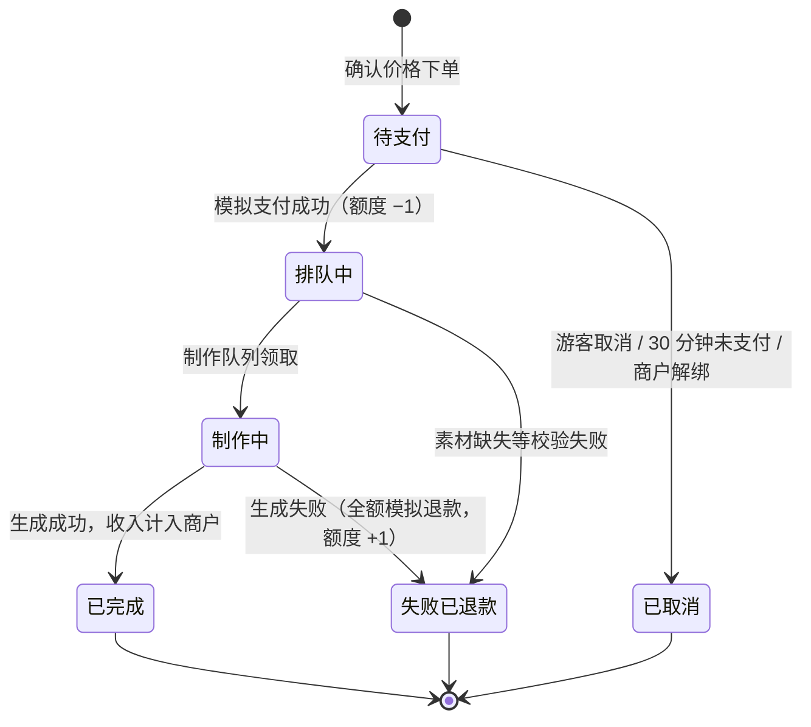

# 影小沐 AIGC 景区旅拍平台 · 需求文档

版本：1.0（基于当前已实现功能整理）　日期：2026-09-29

---

## 1. 文档说明

影小沐 AIGC 是面向景区游客的按次付费 AI 旅拍服务。游客上传人物照片、选择景区模板，就能生成打卡合照、AI 换装照片或换装视频。本文档按当前已实现的系统整理需求，作为后续迭代和验收的基线。

**目标**

- 游客不用充值，每次制作单独模拟支付；制作失败自动退款。
- 每个景区由唯一的景区商户经营。商户购买服务次数，获得游客的消费收入，并可申请提现。
- 平台管理员统一管理模板、账号、景区与商户的绑定、服务启停，以及资金审核。

**范围**：游客端是移动端 H5；商户和管理员使用响应式工作台。三种身份共用同一个登录入口。当前版本的所有资金流都是模拟的，不会发生真实扣款或到账。

**术语**

| 术语 | 含义 |
| --- | --- |
| 服务 | 打卡合拍、AI 换装照片、AI 换装视频三类按次服务 |
| 模板 | 某景区某项服务下，供游客选择的场景。包含封面，以及高清背景、白模或样片 |
| 人物模板 | 游客上传的身体照（必传）和人脸照（可选） |
| 白模 | 用灰色人形标出动作和构图的场景图，供 AI 换装照片使用 |
| 服务额度 | 景区某项服务剩余的可制作次数，由商户购买 |
| 标准成本 | 平台为每项服务设定的单次核算成本，不等于模型供应商的实际账单 |
| 模拟支付 | 走完整的支付流程，但不产生真实资金流动 |

---

## 2. 用户角色与权限

系统有游客、商户、管理员三种角色，共用「我的」页的同一个登录入口，登录后按角色显示对应的入口。商户和管理员也可以作为游客下单。

| 能力 | 游客 | 商户 | 管理员 |
| --- | --- | --- | --- |
| 浏览景区与模板 | 可（免登录） | 可 | 可 |
| 点赞、收藏、上传人物、下单制作 | 可 | 可 | 可 |
| 提交客服工单、申请打印、兑换积分 | 可 | 可 | 可 |
| 购买景区服务次数 | — | 仅限绑定的景区 | 任意已绑定商户的景区（记在该商户名下） |
| 查看模板使用、消费流水、收入 | — | 仅本景区 | 全平台，可按景区筛选 |
| 申请 / 撤销模拟提现 | — | 可 | — |
| 审核提现、模拟打款 | — | — | 可 |
| 处理客服工单 | — | 关联本景区订单的工单 | 全部 |
| 打印履约（标记可取件、核销） | — | 仅本景区 | 全部 |
| 现场服务设置（电话、时间、打印） | — | 仅本景区 | 任意景区 |
| 发行兑换码 | — | 占用发放额度 | 不限额，写入审计日志 |
| 模板新建、编辑、上下架、归档 | — | — | 可 |
| 账号创建、角色、启停、商户名称 | — | — | 可 |
| 景区新建、暂停、服务启停与定价 | — | — | 可 |
| 商户绑定 / 解绑 | — | — | 可 |
| 标准成本、模拟失败率、验证码开关、审计日志 | — | — | 可 |

测试账号：`trial_user`（游客）、`trial_merchant`（商户，绑定老君山）、`trial_admin`（管理员）。

---

## 3. 业务规则

游客每次成功制作的付款归景区商户；商户购买服务次数是一笔独立支出；平台按标准成本核算成功订单。三项服务的默认价格如下。管理员可以按景区调整游客价和商户额度价，单个模板也可以单独定价。

| 服务 | 游客价（元/次） | 商户额度价（元/次） | 默认标准成本（元/次） |
| --- | --- | --- | --- |
| 打卡合拍 | 0.90 | 0.00 | 0.00 |
| AI 换装照片 | 1.90 | 0.30 | 0.25 |
| AI 换装视频 | 9.90 | 2.00 | 1.20 |

### 3.1 景区与商户

- 一个景区只绑定一个商户，一个商户也只绑定一个景区。被绑定的账号必须是已启用的商户或管理员。
- 解绑前，商户必须同时满足：没有制作中的订单、没有待处理的提现、可提现余额为 0。解绑后景区自动暂停，额度保留，未支付的订单自动取消。
- 订单收入归属下单时景区绑定的商户，之后换绑也不会转移。

### 3.2 接单条件

以下四项同时满足才能下单和支付，任何一项不满足就停止接单，并提示原因：
- 景区营业中
- 已绑定商户
- 该服务已启用
- 剩余额度大于 0

剩余额度不足 5 次时，商户端会显示预警。

### 3.3 订单状态



### 3.4 额度扣减与退款

1. 下单时只锁定价格和标准成本，不扣次数。
2. 模拟支付成功时，扣减该景区对应服务 1 次，订单进入制作队列。扣减和状态变更在同一个事务中完成。
3. 制作失败时，订单标记为失败，全额模拟退款，并回补 1 次额度。
4. 所有额度变动（购买、扣减、回补、管理员调整）都写入流水，记录变动后的余额。

### 3.5 收入与提现

```
可提现 = 成功订单收入 − 审核中冻结的金额 − 已打款的金额
```

- 提现金额必须大于 0，最多两位小数，且不超过可提现余额。申请后，这笔金额进入冻结。
- 流程是：待审核 → 审核通过 → 模拟打款。
- 待审核的申请，商户可以撤销。待审核或已审核的申请，管理员可以驳回，驳回必须填写原因。撤销和驳回都会释放冻结金额。
- 购买额度的支出不从收入中扣除。当前全部为模拟金额，真实可提现为 0。

### 3.6 打印履约

1. 商户开放打印申请时，必须填写取件地点。
2. 游客只能对已完成的照片订单申请打印：纸张 6 寸或 7 寸，份数 1–10，同一作品同一时间只能有一个进行中的申请。系统生成 6 位取件码，只有游客本人能看到。
3. 商户下载原图，完成实际打印后，标记为可取件。
4. 游客到店出示取件码，商户输入核对一致后核销，核销后不能重复取件。
5. 待处理和可取件状态下，游客和商户都可以取消申请。应用不收取打印费用，也不控制打印机。

### 3.7 兑换码与积分

- 管理员给商户分配发放额度（单位：积分）。商户生成兑换码时，占用「数量 × 每码积分」的额度；管理员生成不占用额度。
- 每批 1–100 个码，每个码 1–10000 积分，有效期 1–365 天。明文只在生成时显示一次，数据库只保存哈希和末 4 位。
- 每个码只能兑换一次；同一用户重复兑换同一个码，返回「已兑换过」，不会重复入账。
- 撤销未使用（含已过期）的码后，商户占用的额度会退回。
- 积分与在线付款无关。原站当前界面已经隐藏了这个功能的入口，本系统保留。

---

## 4. 游客端功能需求

游客端是移动优先的 H5，底部有五个导航位：首页、换装、人物管理（中间按钮）、发现、我的。浏览不需要登录；点赞、收藏、制作等操作会弹出统一的登录框。

| 页面 | 路径 | 功能要求 |
| --- | --- | --- |
| 景区选择 | / | 首次进入时全屏显示，以欢迎视频为背景；列出景区和营业状态；提供「账号登录 / 管理入口」和价格说明；所选景区存在本地，可以随时切换 |
| 首页 | / | 顶部可切换景区；四个快捷入口（景点打卡、换装拍照、换装摄影、人物管理）；热门爆款 / 图片 / 视频三个分类；卡片显示已制作次数和价格；底部显示景区服务方和联系方式 |
| 换装 | /dress-up | 景点打卡 / AI 换装图片 / AI 换装视频三个 Tab，卡片显示点赞数、价格、已制作次数 |
| 发现 | /discover | 大图模板流，视频模板自动播放样片；可以在卡片上直接点赞、收藏 |
| 模板详情 | /template/:id | 封面或样片、介绍、标签；显示「N 次真实制作 · 点赞 · 收藏」；服务不可用时显示原因，并禁用制作按钮 |
| 制作 | /create/:templateId | 选择或上传人物模板；AI 换装照片可以改用自己上传的白模；勾选本人素材授权确认；确认价格后弹出模拟支付，可以取消 |
| 订单详情 | /orders/:id | 制作中每 2 秒刷新进度和阶段；完成后可预览、保存图片或视频；失败时显示原因和退款金额；照片作品可以申请打印；提供「再做一次」和「联系订单客服」 |
| 人物管理 | /characters | 身体照必传、人脸照可选，单张不超过 10MB，仅支持 JPG / PNG；最多保存 20 个；删除时同步清理原始照片；有进行中的订单时不能删除 |
| 我的 | /me | 头像区；订单 / 收藏 / 打印凭证 / 消费记录 / 客服图标行；商户工作台、管理中心入口；「我的作品」按全部 / 制作中 / 已完成 / 失败筛选；「我的模板」管理人物模板；退出登录 |
| 消费订单 | /orders | 按全部 / 进行中 / 已完成 / 已退款筛选；显示累计模拟消费和退款金额 |
| 收藏 | /favorites | 显示已收藏、且仍在架的模板 |
| 打印凭证 | /prints | 列表按状态筛选；详情显示取件码、取件地点；待处理时可修改，待处理或可取件时可取消 |
| 消费记录 | /points | 显示当前积分；输入兑换码兑换；积分明细 |
| 客服与反馈 | /tickets | 提交工单（标题 + 内容，内容不超过 2000 字），可以关联订单；对话、关闭、重新打开 |
| 用户协议 | /agreement | 服务说明、素材授权、AI 生成内容、退款、个人信息；登录或注册时主动勾选才表示同意 |

**登录与注册**
- 账号：2–20 位字母、数字或下划线。
- 密码：8–20 位，必须同时包含字母和数字。
- 注册只会生成游客账号。
- 管理员开启验证码后，登录和注册都需要输入图形验证码。

---

## 5. 商户端功能需求

商户只经营绑定的那一个景区。未绑定时，工作台只显示「尚未绑定景区，请联系管理员」。入口：我的 → 商户工作台。

| 模块 | 功能要求 |
| --- | --- |
| 经营与额度 | 景区状态；累计成功制作、模拟消费金额、模拟退款（含单数）、可提现、制作中待结算。三项服务各自显示：剩余次数、游客价、商户价、状态（服务可用 / 不足 5 次 / 额度耗尽 / 已停用）。可设「每次购买数量」（1–10000），点击「购买 N 次 · ¥x」后模拟支付，支付成功立即入账。另有购买流水和次数变动明细 |
| 模板使用 | 可选近 7 / 30 / 90 天或全部；按模板显示成功、失败、制作中、收入、点赞、收藏；每日趋势图 |
| 消费流水 | 按成功 / 制作中 / 失败退款筛选；显示订单号、游客 ID、服务与模板、金额、退款。商户看不到游客的作品原图和人物照 |
| 收入与提现 | 显示可提现、申请冻结、累计模拟提现、游客成功消费、额度购买支出；申请模拟提现（金额 + 备注）；提现记录和审核备注；待审核的申请可以撤销 |
| 打印履约 | 按待处理 / 可取件 / 已取件 / 已取消筛选；下载打印原图；标记可取件；输入取件码核销；取消申请 |
| 兑换码 | 显示剩余发放额度；批量生成兑换码，明文只显示一次，可一键复制；按状态筛选；撤销 |
| 客服工单 | 处理关联本景区订单的工单；回复后状态变为「客服已回复」，可以关闭 |
| 服务设置 | 商户名称、联系电话、服务时间（显示在景区首页底部）；开放打印申请开关和取件地点 |

---

## 6. 管理端功能需求

管理中心覆盖全平台，多数面板可以按景区筛选，所有关键操作都写入审计日志。入口：我的 → 管理中心。

| 模块 | 功能要求 |
| --- | --- |
| 平台总览 | 游客成功消费、成功订单标准成本、额度销售收入、失败退款、制作中、待审核提现、待处理工单、账号数；按服务拆分的成功、失败、收入、成本、额度销售；当前的 AI 提供方和 ffmpeg 状态 |
| 景区与商户 | 新建景区（默认暂停）、编辑基本信息；暂停 / 恢复整个景区；单项服务启停；调整游客价和商户额度价；按「每次购买数量」替景区模拟购买次数；手工增减额度；绑定 / 解绑商户；编辑现场服务设置；查看额度流水 |
| 提现审核 | 待审核和待打款的申请列表，附商户当前的钱包信息；审核通过 → 模拟打款；驳回必须填写原因，驳回后释放冻结金额 |
| 模板管理 | 按景区、类型、状态、名称筛选。新建和编辑时可设置：<br>• 基本信息：名称、介绍、标签、模板编码、单独定价、排序、优先推荐<br>• 归属商户：创建后不可修改<br>• 素材：封面、高清背景（可复用已有背景）、白模、预览视频<br>• 合成参数：在背景图上点选人物脚底锚点，并预览人物高度<br>• 视频管线：多景循环或原片多镜头<br>上架前会校验封面和背景。支持上架、下架、归档、恢复 |
| 账号权限 | 按角色筛选、搜索；创建账号；修改角色、启停状态、商户名称，重置密码（修改后该账号需重新登录）。不能降级或停用自己；已绑定景区的商户必须先解绑，才能改为游客或停用。可以给商户分配兑换码发放额度 |
| 消费流水 | 按景区、状态、服务、订单号或游客账号筛选；显示金额、退款、标准成本（失败单不计入）、失败原因、AI 提供方 |
| 额度销售 | 全部商户的额度购买记录 |
| 模板使用 | 与商户端相同，另加标准成本列 |
| 打印履约、客服工作台 | 与商户端相同，范围是全平台，可以按景区筛选 |
| 兑换码 | 全平台的兑换码列表；管理员发行不占用额度 |
| 成本设置 | 三项服务的标准成本（只影响新订单）；模拟 AI 失败率 0–100%；登录 / 注册验证码开关 |
| 审计日志 | 时间、操作者、操作类型、对象、详情，分页查看 |

---

## 7. 非功能需求

| 类别 | 要求 |
| --- | --- |
| 账号安全 | 密码用 scrypt 加盐存储；会话令牌只保存哈希，默认 7 天有效；同一账号和 IP 在 10 分钟内失败 10 次后锁定；可选图形验证码；修改角色、停用或重置密码后，该账号的会话全部失效 |
| 权限 | 所有接口都在服务端按角色和归属校验；商户只能访问本景区的数据；游客只能访问自己的订单、人物、作品、打印凭证 |
| 隐私 | 人物照、自传白模、作品存放在私有目录，只能通过 2 小时有效的签名链接访问；删除人物模板时同步删除原始照片；商户看不到游客的原图和人物照；取件码不对商户展示 |
| 上传限制 | 游客照片不超过 10MB，模板图片不超过 12MB，单张不超过 2000 万像素，仅支持 JPG / PNG / WEBP；视频不超过 120MB，支持 MP4 / MOV / WEBM；图片统一自动旋转并压缩 |
| 资金一致性 | 金额一律用整数「分」存储；支付扣额度、失败退款、提现申请、额度购买都在事务中完成；额度在数据库层约束不能小于 0；所有状态流转都用条件更新，防止重复操作 |
| 可靠性 | 服务重启后，中断的制作会重新排队；已提交给 RunningHub 的任务会继续轮询原任务，不会重复提交 |
| 性能 | 并发制作数可配置（默认 2）；静态资源和公开素材带缓存头 |
| 可用性 | 移动优先，底部导航与常见 App 一致；所有列表都有加载、空状态和错误重试 |
| 可审计 | 管理员和商户的关键操作写入审计日志；额度变动单独记录流水 |

---

## 8. 验收用例与当前限制

### 8.1 核心验收用例

以下用例已由自动化测试（`npm test`）或界面实测覆盖。

- [ ] 商户在「经营与额度」购买 AI 换装照片 10 次（¥3.00），模拟支付后，剩余次数 +10；重复支付同一单会被拒绝
- [ ] 游客上传人物照片，选择照片模板，下单后次数不变；模拟支付后次数 −1；制作完成后，作品可以预览和下载
- [ ] 私有作品链接去掉签名参数后，返回 403
- [ ] 商户看到收入增加；申请提现后，冻结金额增加、可提现减少；超过可提现余额的申请被拒绝
- [ ] 管理员在未审核时不能打款；审核通过后可以模拟打款，商户的累计提现随之增加
- [ ] 管理员驳回时必须填写原因；驳回后冻结金额释放
- [ ] 模拟失败率设为 100% 时，订单失败，全额退款，次数回补，失败单不计入收入
- [ ] 额度清零、服务停用或景区暂停后，游客无法下单，并看到原因
- [ ] 商户有未结清收入时不能解绑；已绑定商户的账号不能再绑定其他景区
- [ ] 游客不能访问商户接口，商户不能访问管理接口，商户不能查看游客的订单
- [ ] 关联订单的工单由订单所属商户处理；商户回复后，工单状态变为「客服已回复」
- [ ] 商户未开放打印时，游客不能申请；开放时必须填写取件地点；份数超过 10 被拒绝；同一作品不能重复申请；未标记可取件不能核销；取件码错误时核销失败
- [ ] 商户没有发放额度时不能发行兑换码；兑换成功积分入账；重复兑换不重复入账；撤销后额度退回，被撤销的码不能再兑换
- [ ] 开启验证码后，不带验证码的登录被拒绝
- [ ] 管理员替景区购买 10 次，额度 +10；修改现场服务设置后，景区信息同步更新

### 8.2 当前限制

- **支付**：所有支付、充值、提现都是模拟的，没有接入真实支付渠道。
- **AI 生成**：默认使用本地模拟生成（图像合成和视频叠加），不是真正的 AI 换装。RunningHub 适配器已经实现，但还没有用真实 API Key 和工作流验证过。
- **素材**：金殿合拍模板的高清合成背景原图无法从原站下载，目前用生成的背景代替，需要从服务器取出原图替换。
- **用户协议**：协议页只是占位文本，正式上线前需要法务补充完善。
- **部署规模**：只支持单机部署。数据库是 SQLite；登录限流和验证码状态保存在进程内存中，服务重启会清空，多实例之间也不能共享。
- **新手引导页**：原站已把它重定向回首页，本系统没有实现。
